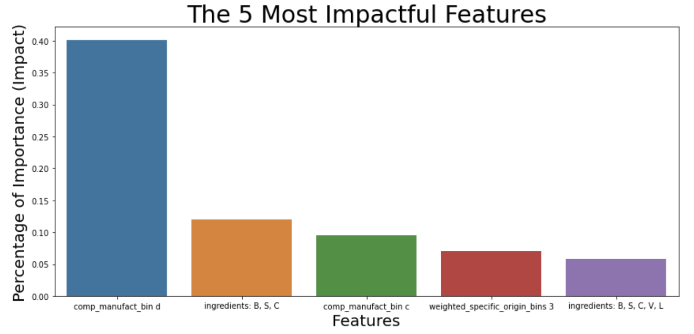
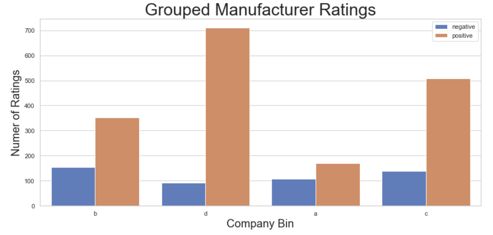
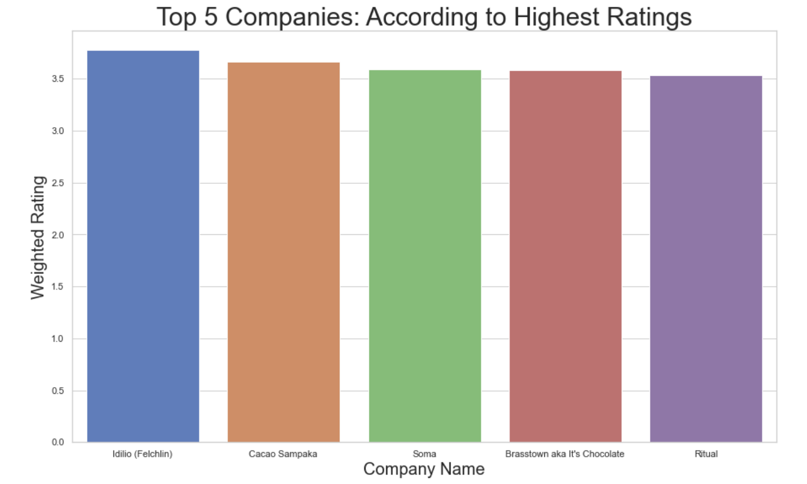
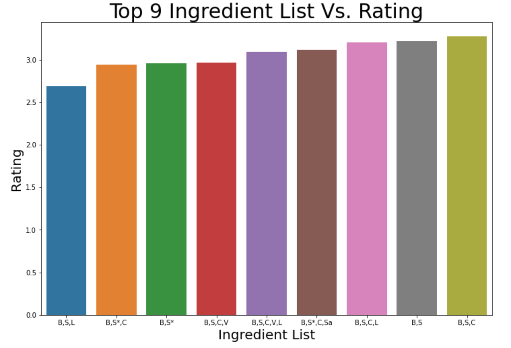

# Chocolate Rating Analysis


## Authors:
Mallory Wilson, Dorothy Alexander, James Chandler O'Neal


## Overview

A chocolate company wants to find out why some of their dark chocolate bars sell and why some of it does not sell as well. The focus  of this project is to analyze different features that go into a high rated chocolate bar. The project observed the Flavors of Cacao Dark Chocolate Dataset that contained information on the company location, bean origin, cocoa percent, ingredients, memorable characteristics, and rating. The categorical features were transformed by one hot encoding. This analysis could be useful for chocolate companies to determine what goes into a high rated chocolate bar.  


## Business Problem

A chocolate company, Hu Kitchen, wants to find out why some of their dark chocolate bars sell and why some of them do not sell as well. The focus  of this project is to analyze different features that go into a high rated chocolate bar. The project observed the Flavors of Cacao dark chocolate dataset that contained information on the company location, bean origin, cocoa percent, ingredients, memorable characteristics, and rating. The categorical features were transformed by one hot encoding. This analysis could be useful for chocolate companies to determine what goes into a high rated chocolate bar.  


## Data 
The Flavors of Cacao dataset contained multiple columns that could have an impact on our target, what the rating of a chocolate bar is. These include the percent of cocoa, the most memorable characteristic, the company location, where the bean is from, the rating of the chocolate, and the different ingredients that were used.   


## Methods

This project uses different forms of modeling and inferential analysis, in order to find relationships between different chocolate variables and features. The first thing done was turning all of the categorical data into 0's and 1's so that they could be put into model's. The project began with a baseline logistic regression model, then some decision tree models, a random forest classifier, and a pipline model. A Grid Search was performed to find out which hyperparameters worked best for the models. These models were then tuned with different hyperparameters that were found. 
 


## Results



The visualization above displays the five most impactful features that make a high rated chocolate bar. The most impactful feature is where the chocolate bar is manufactuered by a certain company. The company manuufacturer bin d was created by the overall top companies with the highest success rate.

---


 
Above shows the manufacturer ratings that are broken down into four different groups. These groups were formed by looking at the company manufacturers from least successful to most successful according to ratings. 

---



This visual graph goes in depth into which companies have the majority of most successful chocolate bars in bin d. 

---




This graph displays the top 9 ingredients that goes into making a high rating chocolate bar. The ingredient list with the highest rating consists of B,S,C. 

---


## Conclusions
After testing many different models with different features, the chocolate features that are most impactful on the rating of chocolate includes chocolate bars that contain the ingredients Bean, Sugar, and Cocoa Butter. Chocolate made by these five companies: Idilo, Cacao Sampaka, Soma, Brasstown aka It's Chocolate, and Ritual. 


## Next Steps
The next steps that should be taken would be to look into other kinds of chocolate, such as milk chocolate since this database only contained dark chocolate. Also, creating a Graphical User Interface(GUI) would be helpful for companies to input features of chocolate they are looking at and the GUI will produce a prediction of what the rating of their chocolate would be. One last step to take would be to look into how extra ingredients, such as nuts or caramel affect the rating of the candy bar. 

## For More Information

Please review the full analysis via [Jupyter Notebook](./notebooks/final_notebook.ipynb) or [Powerpoint](./Chocolate_Rating_Analysis.pdf). For any additional question please contact Mallory Wilson at mallorye1103@gmail.com, Dorothy Alexander at dorothy408@gmail.com, and James Chandler O'Neal at jchandleroneal@gmail.com 


## Repository Structure
```
├── README.md                           <- The top-level README for reviewers of this project
├── final_notebook.ipynb   <- Narrative documentation of analysis in Jupyter notebook
├── Chocolate_Rating_Analysis.pdf         <- PDF version of project presentation
├── data                                <- Both sourced externally and generated from code
└── images   

